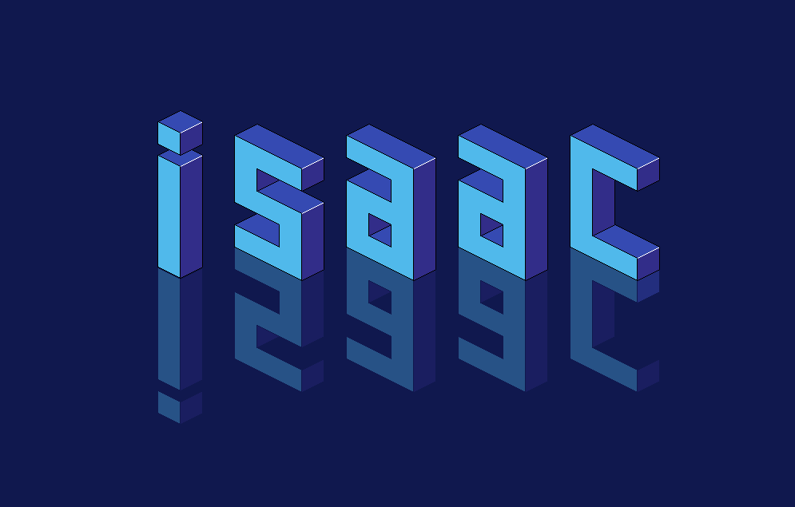

# Welcome! ようこそ！ 👋

## I'm Isaac, thanks for visiting!
### Full stack developer, mechanical engineer, and maker of dope pizzas.

- 🔭 I’m currently working on my [`Portfolio`](https://github.com/anthonybench/MyPortfolio)
- 🌱 I’m currently learning *`ASP.NET Core`*
- 🤔 I’m looking for help with my [`ASCII art repo`](https://github.com/anthonybench/ASCII_art)
- ⚡ Fun fact: I'm an impassioned woodworker, and dedicated skateboarder!

## Connect with me:

  

## Languages and Tools:

  

