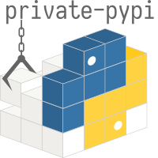

# Welcome! ようこそ！ 👋

## Thanks for stopping by! 👾
I'm a finish carpenter who loves kayaking, skateboarding, and rock climbing.\
Life long engineer, professional kid.

| Current Interests | Want to dive into |
|:---|---:|
| 🤖 Automation | Game Development 🎮 |
| 🗄️ Data Architecture | Voice Applications 🎤 |
| 🌎 Web Development | Crocheting 🧶 |

 

### ***Connect with me!***

‎ ‎ ‎ ‎ ‎

### ***More stuffs!***

‎ ‎ ‎ ‎ ‎

‎ ‎ ‎ ‎ ‎
